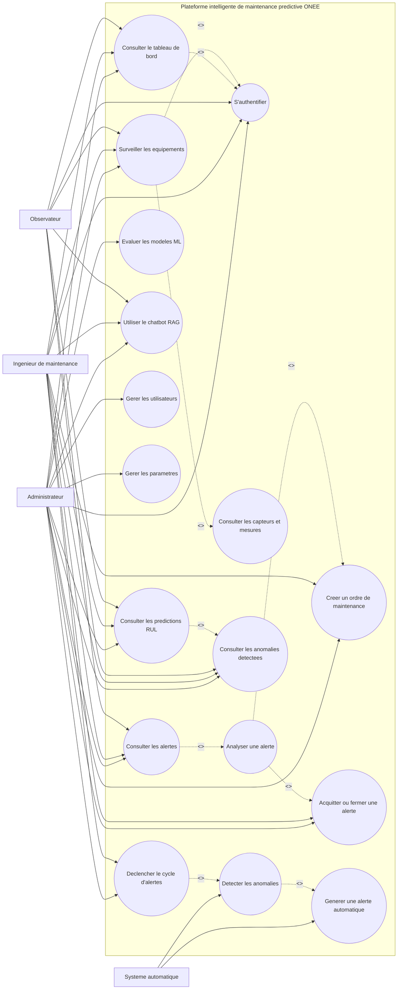
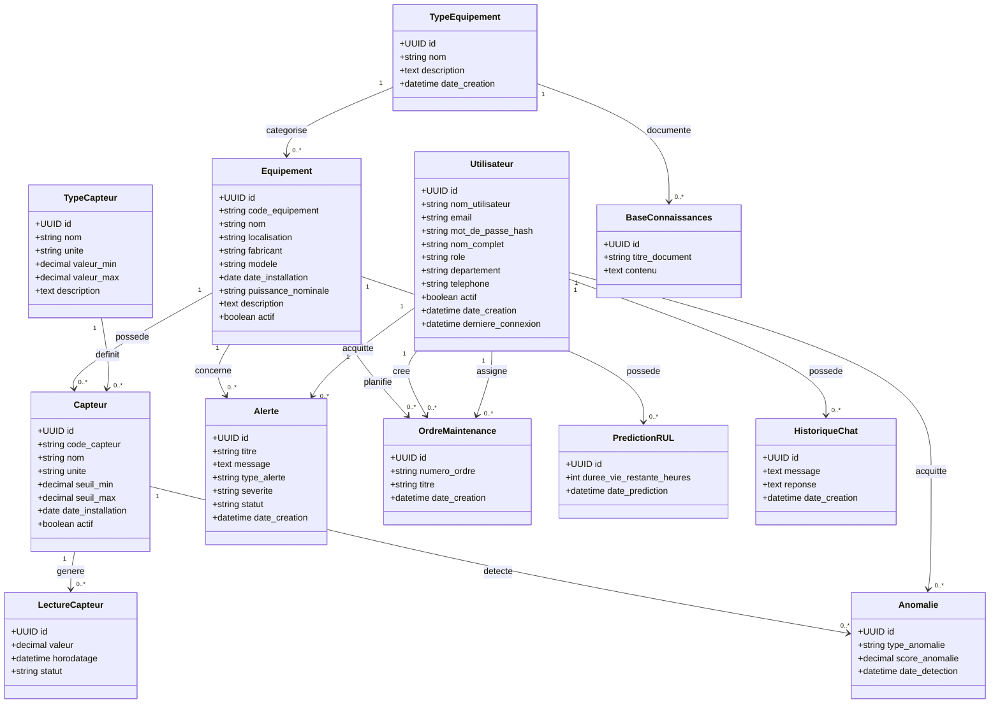
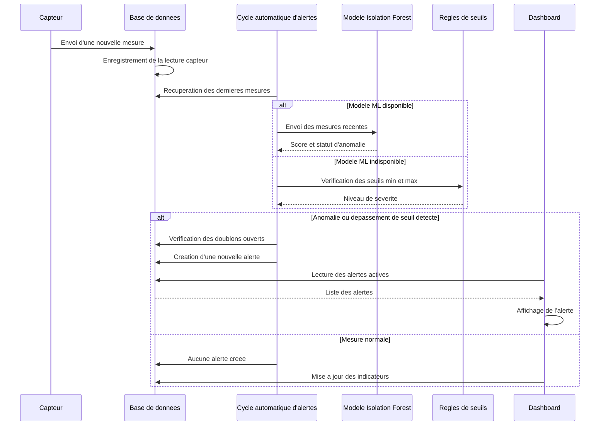

# Rapport PFE

## Titre du projet

**Conception et realisation d'une plateforme intelligente de maintenance predictive pour une centrale thermique**

---

## Remerciements

Je tiens a exprimer ma profonde gratitude a toutes les personnes qui ont contribue, de pres ou de loin, a la realisation de ce projet de fin d'etudes.

Je remercie tout d'abord mes encadrants pedagogiques pour leur accompagnement, leurs conseils et leurs orientations tout au long de ce travail. Leurs remarques m'ont permis d'ameliorer progressivement la qualite technique et methodologique du projet.

Je remercie egalement l'organisme d'accueil, ainsi que l'ensemble du personnel technique, pour leur disponibilite et pour les informations fournies concernant le fonctionnement des equipements industriels et les enjeux de la maintenance dans une centrale thermique.

Enfin, j'adresse mes remerciements a ma famille et a mes proches pour leur soutien moral, leur patience et leurs encouragements durant toute la periode de realisation de ce projet.

---

## Resume

La maintenance des equipements industriels represente un enjeu majeur pour les centrales thermiques, ou la disponibilite, la securite et la performance des machines sont essentielles. Les methodes classiques de maintenance, telles que la maintenance corrective et preventive, presentent certaines limites, notamment les arrets imprevus, les couts eleves et l'absence d'une analyse precise de l'etat reel des equipements.

Ce projet consiste a concevoir et realiser une plateforme intelligente de maintenance predictive pour une centrale thermique. La solution proposee permet de suivre les equipements en temps reel, de detecter les anomalies, de predire la duree de vie restante des composants, de gerer les alertes et d'assister les utilisateurs a travers un chatbot intelligent base sur une architecture RAG.

Le systeme repose sur un backend developpe avec Python et FastAPI, une interface utilisateur realisee avec Streamlit, une base de donnees PostgreSQL, ainsi que des modeles de Machine Learning tels que Isolation Forest pour la detection d'anomalies et XGBoost pour la prediction du RUL. Le projet integre egalement ChromaDB, LangChain et des embeddings pour le module d'assistance intelligente.

**Mots-cles :** maintenance predictive, Machine Learning, centrale thermique, detection d'anomalies, RUL, Streamlit, FastAPI, RAG.

---

## Abstract

Industrial equipment maintenance is a major challenge in thermal power plants, where machine availability, safety and performance are essential. Traditional maintenance approaches, such as corrective and preventive maintenance, have several limitations, including unexpected shutdowns, high costs and the lack of real-time equipment condition analysis.

This project aims to design and implement an intelligent predictive maintenance platform for a thermal power plant. The proposed solution provides real-time equipment monitoring, anomaly detection, remaining useful life prediction, alert management and technical assistance through an intelligent RAG-based chatbot.

The system is based on a Python FastAPI backend, a Streamlit dashboard, a PostgreSQL database and Machine Learning models such as Isolation Forest for anomaly detection and XGBoost for RUL prediction. The project also integrates ChromaDB, LangChain and embeddings for the intelligent assistant module.

**Keywords:** predictive maintenance, Machine Learning, thermal power plant, anomaly detection, RUL, Streamlit, FastAPI, RAG.

---

# Introduction generale

Dans un contexte industriel marque par la recherche continue de performance, de fiabilite et de reduction des couts, la maintenance des equipements occupe une place essentielle dans le bon fonctionnement des installations de production. Les centrales thermiques reposent sur des equipements critiques tels que les turbines, les chaudieres, les alternateurs, les pompes et les systemes auxiliaires. Une defaillance au niveau de l'un de ces elements peut entrainer des pertes economiques importantes, une baisse de rendement, des interruptions de service ou encore des risques pour la securite.

Les methodes classiques de maintenance sont generalement basees sur deux approches principales. La maintenance corrective intervient apres l'apparition d'une panne, tandis que la maintenance preventive consiste a programmer des interventions selon un calendrier fixe. Bien que ces methodes soient largement utilisees, elles ne permettent pas toujours d'anticiper les defaillances avec precision. La maintenance corrective provoque souvent des arrets non planifies, alors que la maintenance preventive peut conduire a des interventions inutiles lorsque les equipements sont encore en bon etat.

Face a ces limites, la maintenance predictive constitue une approche plus avancee. Elle repose sur la collecte et l'analyse des donnees issues des capteurs afin d'evaluer l'etat reel des equipements et de prevoir les pannes avant leur apparition. Grace aux progres de l'intelligence artificielle, du Machine Learning et de l'analyse de donnees, il devient possible de detecter automatiquement les comportements anormaux et d'estimer la duree de vie restante des composants critiques.

Ce projet s'inscrit dans cette vision. Il a pour objectif de concevoir et realiser une plateforme intelligente de maintenance predictive destinee aux equipements d'une centrale thermique. La solution developpee permet le suivi des equipements, l'analyse des mesures capteurs, la detection d'anomalies, la prediction du RUL, la gestion des alertes et l'assistance technique via un chatbot intelligent.

Le present rapport decrit les differentes etapes de realisation du projet. Il commence par la presentation du contexte general, puis expose l'analyse des besoins, la conception du systeme, les choix technologiques, la mise en oeuvre de la solution ainsi que les tests et resultats obtenus.

---

# Chapitre 1 : Contexte general du projet

## 1.1 Presentation de l'organisme d'accueil

L'organisme d'accueil s'inscrit dans le secteur de la production, du transport ou de la distribution de l'energie electrique. Dans ce type d'environnement, les installations industrielles doivent fonctionner de maniere continue afin de garantir la disponibilite de l'energie et la stabilite du reseau.

Dans le cadre de ce projet, l'etude porte sur une centrale thermique, qui transforme l'energie thermique en energie electrique. Ce type d'installation comprend plusieurs equipements strategiques, notamment les turbines, les chaudieres, les alternateurs, les condenseurs, les pompes et les systemes de refroidissement. Ces equipements sont soumis a des contraintes mecaniques, thermiques et vibratoires importantes.

La maintenance joue donc un role central dans l'exploitation d'une centrale thermique. Elle permet de garantir la disponibilite des equipements, de reduire les risques de panne, d'ameliorer la securite et d'optimiser les couts d'exploitation.

## 1.2 Presentation du domaine de la maintenance industrielle

La maintenance industrielle regroupe l'ensemble des actions techniques, administratives et organisationnelles visant a maintenir ou retablir un equipement dans un etat lui permettant d'assurer sa fonction.

On distingue principalement trois types de maintenance :

- **Maintenance corrective :** intervention apres l'apparition d'une panne.
- **Maintenance preventive :** intervention planifiee selon des periodes ou des conditions definies.
- **Maintenance predictive :** intervention basee sur l'analyse de l'etat reel de l'equipement a partir des donnees collectees.

La maintenance predictive s'appuie sur les capteurs, les donnees historiques, les algorithmes statistiques et les modeles d'intelligence artificielle. Elle permet d'anticiper les defaillances, d'optimiser la planification des interventions et de reduire les arrets imprevus.

## 1.3 Problematique

Dans une centrale thermique, les equipements critiques doivent etre surveilles en permanence. Cependant, les methodes classiques de maintenance ne permettent pas toujours de detecter les signes faibles precedant une panne. Les donnees issues des capteurs sont souvent nombreuses, variees et difficiles a analyser manuellement en temps reel.

La problematique principale peut donc etre formulee comme suit :

**Comment concevoir une solution intelligente capable de surveiller les equipements d'une centrale thermique, de detecter les anomalies, de predire les defaillances et d'aider les equipes de maintenance dans leur prise de decision ?**

## 1.4 Objectifs du projet

L'objectif principal de ce projet est de mettre en place une plateforme intelligente de maintenance predictive.

Les objectifs specifiques sont :

- Concevoir une architecture logicielle adaptee a la surveillance industrielle.
- Centraliser les donnees des equipements, capteurs, lectures et alertes.
- Developper un dashboard interactif pour visualiser l'etat des equipements.
- Detecter automatiquement les anomalies a partir des donnees capteurs.
- Predire la duree de vie restante des equipements ou composants.
- Gerer les alertes selon leur severite et leur statut.
- Integrer un assistant intelligent capable de repondre aux questions techniques.
- Securiser l'acces a la plateforme avec un systeme d'authentification.

## 1.5 Methodologie de travail

La realisation du projet a suivi une demarche progressive :

1. Analyse du contexte industriel et identification des besoins.
2. Etude des solutions existantes et de leurs limites.
3. Conception de l'architecture generale du systeme.
4. Modelisation de la base de donnees.
5. Developpement du backend et des API.
6. Developpement de l'interface Streamlit.
7. Integration des modeles de Machine Learning.
8. Mise en place du chatbot intelligent.
9. Tests fonctionnels et validation des resultats.

---

# Chapitre 2 : Analyse et specification des besoins

## 2.1 Etude de l'existant

Dans plusieurs environnements industriels, la surveillance des equipements repose encore sur des inspections periodiques, des rapports manuels ou des systemes de supervision classiques. Ces methodes permettent de suivre certains parametres, mais elles restent limitees lorsqu'il s'agit d'analyser de grands volumes de donnees ou d'anticiper automatiquement les defaillances.

Les systemes SCADA, par exemple, permettent de superviser les installations en temps reel, mais ils ne fournissent pas toujours des fonctions avancees de prediction ou d'aide intelligente a la decision. De meme, les historiques de maintenance peuvent etre exploites, mais leur analyse reste souvent manuelle ou partielle.

## 2.2 Limites des methodes classiques

Les methodes traditionnelles presentent plusieurs limites :

- Les pannes sont parfois detectees trop tard.
- Les interventions preventives peuvent etre couteuses ou inutiles.
- L'analyse manuelle des donnees capteurs est complexe.
- Les informations sont parfois dispersees entre plusieurs outils.
- Les equipes de maintenance manquent d'indicateurs predictifs fiables.
- La prise de decision peut etre ralentie par l'absence d'une vue globale.

Ces limites justifient la mise en place d'une solution de maintenance predictive basee sur l'analyse intelligente des donnees.

## 2.3 Besoins fonctionnels

La plateforme doit permettre :

- L'authentification des utilisateurs.
- La gestion des roles : administrateur, ingenieur, utilisateur de consultation.
- L'affichage d'un tableau de bord global.
- Le suivi des equipements industriels.
- La consultation des capteurs associes a chaque equipement.
- L'affichage des mesures en temps reel ou simulees.
- La detection des anomalies.
- La prediction du RUL.
- La creation et la consultation des alertes.
- La gestion des ordres de maintenance.
- L'affichage de graphiques et d'indicateurs.
- L'utilisation d'un chatbot technique intelligent.
- La consultation de l'historique des donnees et evenements.

## 2.4 Besoins non fonctionnels

La solution doit respecter plusieurs exigences non fonctionnelles :

- **Securite :** protection des acces par authentification et mots de passe haches.
- **Fiabilite :** disponibilite des informations critiques.
- **Performance :** temps de reponse acceptable pour les pages et API.
- **Ergonomie :** interface claire et simple a utiliser.
- **Maintenabilite :** code organise en modules.
- **Extensibilite :** possibilite d'ajouter de nouveaux equipements ou modeles.
- **Traçabilite :** conservation des historiques et alertes.

## 2.5 Acteurs du systeme

Les principaux acteurs sont :

- **Administrateur :** gere les utilisateurs, les roles et la configuration.
- **Ingenieur de maintenance :** surveille les equipements, analyse les alertes et planifie les interventions.
- **Technicien :** consulte les alertes et execute les actions de maintenance.
- **Utilisateur consultant :** visualise les indicateurs sans modifier les donnees sensibles.

---

# Chapitre 3 : Conception du systeme

## 3.1 Architecture generale

La plateforme adopte une architecture modulaire composee de plusieurs couches :

- **Couche presentation :** dashboard Streamlit utilise par les utilisateurs.
- **Couche backend :** API FastAPI assurant la logique metier.
- **Couche donnees :** base PostgreSQL contenant les equipements, capteurs, lectures, alertes et utilisateurs.
- **Couche intelligence artificielle :** modeles ML pour la detection d'anomalies et la prediction du RUL.
- **Couche assistant intelligent :** chatbot RAG utilisant une base vectorielle ChromaDB.

Cette architecture permet de separer les responsabilites et de faciliter l'evolution du systeme.

## 3.2 Architecture technique

Le backend est developpe avec Python et FastAPI. Il expose des endpoints permettant de gerer les utilisateurs, les equipements, les capteurs, les lectures, les anomalies et les alertes.

L'interface utilisateur est developpee avec Streamlit. Elle propose plusieurs pages : authentification, dashboard principal, monitoring, predictions, chatbot, maintenance et parametres.

La base de donnees PostgreSQL stocke les donnees structurees. SQLAlchemy est utilise comme ORM pour faciliter les interactions entre Python et la base.

Les modeles Machine Learning sont utilises pour analyser les donnees capteurs. Isolation Forest sert a identifier les comportements anormaux, tandis que XGBoost permet d'estimer la duree de vie restante.

## 3.3 Modelisation de la base de donnees

La base de donnees contient plusieurs entites principales :

- **Users :** informations des utilisateurs.
- **Equipment :** liste des equipements industriels.
- **Sensors :** capteurs associes aux equipements.
- **Readings :** mesures collectees par les capteurs.
- **Alerts :** alertes generees par le systeme.
- **MaintenanceOrders :** ordres de maintenance.
- **Predictions :** resultats produits par les modeles ML.

Les relations principales sont :

- Un equipement peut posseder plusieurs capteurs.
- Un capteur peut generer plusieurs lectures.
- Un equipement peut etre associe a plusieurs alertes.
- Une alerte peut declencher une action de maintenance.

## 3.4 Diagrammes UML

Cette section presente les principaux diagrammes UML utilises pour decrire le fonctionnement de la plateforme. Ces diagrammes permettent de mieux comprendre les interactions entre les acteurs, la structure des donnees et le deroulement du processus de detection d'anomalies.

### 3.4.1 Diagramme de cas d'utilisation

Le diagramme de cas d'utilisation represente les interactions entre les differents acteurs et les fonctionnalites principales de la plateforme. Les acteurs identifies sont l'administrateur, l'ingenieur de maintenance et l'observateur. Le diagramme detaille egalement les cas obligatoires, comme l'authentification, ainsi que les extensions possibles, comme la creation d'un ordre de maintenance apres l'analyse d'une alerte.



L'administrateur dispose d'un acces complet a la plateforme. Il peut consulter les donnees, suivre les alertes, evaluer les modeles, gerer les utilisateurs, modifier les parametres et declencher manuellement un cycle d'alertes. L'ingenieur de maintenance utilise principalement la plateforme pour surveiller les equipements, analyser les alertes, consulter les predictions RUL et creer des ordres de maintenance. L'observateur possede un acces limite, oriente vers la consultation du tableau de bord, du monitoring, des alertes, des predictions et du chatbot.

### 3.4.2 Diagramme de classes

Le diagramme de classes presente les principales entites du systeme ainsi que leurs relations. Il permet de representer la structure logique de la base de donnees et les objets manipules par l'application.



La classe `Utilisateur` represente les comptes de la plateforme et leurs roles. La classe `Equipement` decrit les equipements industriels surveilles et elle est rattachee a un `TypeEquipement`. Chaque equipement possede plusieurs `Capteur`, eux-memes rattaches a un `TypeCapteur`. Les valeurs mesurees sont stockees dans `LectureCapteur`. Les comportements anormaux sont representes par `Anomalie`, tandis que les alertes operationnelles sont stockees dans `Alerte`. Les interventions sont gerees par `OrdreMaintenance`. Les resultats de prediction de duree de vie restante sont representes par `PredictionRUL`. Enfin, `HistoriqueChat` et `BaseConnaissances` supportent le fonctionnement du chatbot RAG.

### 3.4.3 Diagramme de sequence : detection d'une anomalie

Le diagramme de sequence suivant decrit le processus de detection d'une anomalie a partir des mesures capteurs. Il montre le cheminement des donnees depuis la lecture en base jusqu'a la creation d'une alerte et son affichage dans le dashboard.



Dans ce scenario, le capteur transmet une mesure qui est d'abord enregistree dans la base de donnees. Le cycle automatique d'alertes recupere ensuite les dernieres mesures. Si le modele Isolation Forest est disponible, il analyse le comportement des mesures. Sinon, le systeme applique les regles de seuils min et max. Lorsqu'une anomalie ou un depassement de seuil est detecte, une alerte est creee en base apres verification des doublons, puis elle devient visible dans le dashboard.

## 3.5 Description des modules principaux

### Module authentification

Ce module permet aux utilisateurs de se connecter de maniere securisee. Les mots de passe sont haches avec Bcrypt et l'authentification repose sur des jetons JWT.

### Module monitoring

Ce module affiche les equipements, les capteurs et les mesures collectees. Il permet d'avoir une vision globale et detaillee de l'etat du systeme.

### Module Machine Learning

Ce module analyse les donnees capteurs afin de detecter les anomalies et predire la duree de vie restante. Il aide les equipes a intervenir avant l'apparition d'une panne.

### Module alertes

Ce module gere les alertes selon leur type, leur gravite et leur statut. Les alertes peuvent etre actives, resolues ou en cours de traitement.

### Module chatbot RAG

Ce module permet aux utilisateurs de poser des questions techniques. Le chatbot recherche les informations pertinentes dans une base de connaissances, puis genere une reponse adaptee.

---

# Chapitre 4 : Realisation de la solution

## 4.1 Environnement de developpement

Le projet a ete developpe dans un environnement Python avec les outils suivants :

- Systeme d'exploitation : Windows.
- Langage principal : Python.
- Editeur : Visual Studio Code.
- Backend : FastAPI.
- Interface : Streamlit.
- Base de donnees : PostgreSQL.
- ORM : SQLAlchemy.
- Machine Learning : Scikit-learn, XGBoost.
- Assistant intelligent : LangChain, ChromaDB.

## 4.2 Technologies utilisees

### Python

Python a ete choisi pour sa simplicite, sa richesse en bibliotheques et son adoption dans les domaines du Machine Learning, de l'analyse de donnees et du developpement backend.

### FastAPI

FastAPI permet de construire des API rapides, modernes et bien structurees. Il facilite la creation d'endpoints REST et la validation des donnees.

### Streamlit

Streamlit permet de developper rapidement des interfaces interactives pour les applications de donnees. Il a ete utilise pour realiser le dashboard de supervision.

### PostgreSQL

PostgreSQL est un systeme de gestion de base de donnees relationnelle robuste. Il permet de stocker les donnees des utilisateurs, equipements, capteurs, lectures et alertes.

### Scikit-learn et XGBoost

Scikit-learn fournit les outils necessaires pour la detection d'anomalies avec Isolation Forest. XGBoost est utilise pour la prediction du RUL grace a sa performance dans les problemes de regression.

### LangChain et ChromaDB

LangChain facilite la construction du chatbot RAG. ChromaDB est utilisee pour stocker et rechercher les documents sous forme vectorielle.

## 4.3 Developpement du backend

Le backend regroupe la logique metier de l'application. Il assure :

- La connexion a la base de donnees.
- La gestion des modeles ORM.
- L'authentification des utilisateurs.
- L'exposition des endpoints REST.
- La recuperation des donnees des equipements.
- La gestion des alertes et predictions.

Les principaux fichiers backend sont :

- `main.py` : API principale.
- `database.py` : configuration de la base.
- `models.py` : modeles SQLAlchemy.
- `auth.py` : securite et authentification.
- `ml_models.py` : modeles Machine Learning.
- `rag_chatbot.py` : assistant intelligent.
- `data_generator.py` : generation de donnees synthetiques.

## 4.4 Developpement du dashboard

Le dashboard Streamlit constitue l'interface principale de l'utilisateur. Il permet de visualiser les informations essentielles sous forme de pages, indicateurs et graphiques.

Les pages principales sont :

- **Authentification :** connexion securisee.
- **Dashboard principal :** vue generale sur l'etat du systeme.
- **Monitoring temps reel :** suivi des mesures capteurs.
- **Predictions :** affichage des anomalies et du RUL.
- **Chatbot :** assistance technique intelligente.
- **Gestion maintenance :** suivi des interventions.
- **Parametres :** configuration utilisateur.

## 4.5 Module Machine Learning

Le module Machine Learning a deux objectifs principaux.

Le premier est la detection d'anomalies. Pour cela, le modele Isolation Forest analyse les mesures des capteurs et identifie les valeurs qui s'ecartent du comportement normal.

Le second est la prediction du RUL. Le RUL, ou Remaining Useful Life, represente la duree de vie restante estimee d'un equipement ou composant. Le modele XGBoost est utilise pour produire cette estimation a partir des donnees historiques et des caracteristiques capteurs.

Les resultats des modeles permettent d'aider les equipes de maintenance a prioriser les interventions.

## 4.6 Module chatbot intelligent RAG

Le chatbot intelligent repose sur une architecture RAG, c'est-a-dire Retrieval Augmented Generation. Cette approche combine deux etapes :

1. Recherche d'informations pertinentes dans une base de connaissances.
2. Generation d'une reponse a partir des informations recuperees.

La base vectorielle ChromaDB permet de stocker les documents sous forme d'embeddings. Lorsqu'un utilisateur pose une question, le systeme recherche les passages les plus proches semantiquement, puis le modele de langage produit une reponse claire et contextualisee.

Ce module aide les utilisateurs a comprendre les alertes, les equipements, les procedures de maintenance et les resultats du systeme.

## 4.7 Systeme d'alertes

Le systeme d'alertes permet de signaler les situations critiques. Une alerte contient notamment :

- Un titre.
- Un message.
- Un equipement concerne.
- Un type d'alerte.
- Un niveau de severite.
- Un statut.
- Une date de creation.

Les niveaux de severite peuvent etre, par exemple : faible, moyen, eleve ou critique. Les alertes critiques permettent d'attirer rapidement l'attention des equipes de maintenance sur les equipements a risque.

---

# Chapitre 5 : Tests et resultats

## 5.1 Tests fonctionnels

Les tests fonctionnels permettent de verifier que les principales fonctionnalites repondent aux besoins definis.

Les tests realises concernent :

- La connexion utilisateur.
- L'affichage du dashboard.
- La consultation des equipements.
- L'affichage des capteurs.
- La generation des donnees.
- La creation des alertes.
- La consultation des predictions.
- Le fonctionnement du chatbot.

## 5.2 Tests d'authentification

Les tests d'authentification verifient :

- La connexion avec des identifiants valides.
- Le refus d'une connexion avec des identifiants invalides.
- Le hachage des mots de passe.
- La generation et l'utilisation des jetons JWT.
- Le controle d'acces selon les roles.

Ces tests garantissent que seules les personnes autorisees peuvent acceder a la plateforme.

## 5.3 Tests du dashboard

Les tests du dashboard portent sur :

- L'affichage correct des pages.
- La lisibilite des indicateurs.
- La coherence des graphiques.
- La navigation entre les modules.
- L'affichage des alertes actives.
- La mise a jour des donnees apres generation ou modification.

Le dashboard permet une lecture rapide de l'etat des equipements et facilite la prise de decision.

## 5.4 Tests des modeles ML

Les tests des modeles Machine Learning consistent a verifier :

- La capacite a detecter des valeurs anormales.
- La coherence des scores d'anomalie.
- La generation de predictions RUL.
- La stabilite des resultats sur les donnees synthetiques.
- L'integration des resultats dans le dashboard.

Ces tests montrent que les modeles peuvent identifier des situations a risque et fournir des informations utiles aux equipes de maintenance.

## 5.5 Resultats obtenus

La solution developpee permet d'obtenir les resultats suivants :

- Une interface centralisee pour la surveillance des equipements.
- Une base de donnees structuree pour stocker les informations industrielles.
- Un systeme d'authentification securise.
- Une detection automatique des anomalies.
- Une prediction de la duree de vie restante.
- Une gestion des alertes selon leur criticite.
- Un chatbot intelligent pour l'assistance technique.
- Une architecture modulaire pouvant etre etendue.

Ces resultats montrent que la plateforme repond aux objectifs fixes et constitue une base solide pour une solution de maintenance predictive en environnement industriel.

---

# Conclusion generale

Ce projet de fin d'etudes a permis de concevoir et realiser une plateforme intelligente de maintenance predictive pour les equipements d'une centrale thermique. La solution proposee repond a un besoin important dans le domaine industriel : anticiper les defaillances, reduire les arrets imprevus et ameliorer la prise de decision des equipes de maintenance.

Le travail realise a couvert plusieurs aspects : analyse des besoins, conception de l'architecture, modelisation de la base de donnees, developpement du backend, creation du dashboard, integration de modeles Machine Learning et mise en place d'un chatbot intelligent base sur l'approche RAG.

Les technologies utilisees, notamment Python, FastAPI, Streamlit, PostgreSQL, Scikit-learn, XGBoost, LangChain et ChromaDB, ont permis de construire une solution moderne, interactive et evolutive.

Les resultats obtenus montrent que le systeme est capable de centraliser les donnees, surveiller les equipements, detecter les anomalies, produire des predictions et assister les utilisateurs. Cette plateforme represente ainsi une contribution concrete a l'amelioration de la maintenance industrielle.

---

# Perspectives

Plusieurs ameliorations peuvent etre envisagees :

- Connecter la plateforme a de vrais capteurs industriels IoT.
- Ameliorer les modeles ML avec des donnees reelles historiques.
- Ajouter des notifications par email, SMS ou application mobile.
- Integrer un systeme de planification automatique des interventions.
- Ajouter des tableaux de bord avances pour les responsables.
- Deployer la solution sur un serveur cloud ou local industriel.
- Renforcer la securite avec une authentification multi-facteur.
- Ajouter un module de reporting PDF automatique.

---

# Bibliographie

- Documentation officielle Python : https://www.python.org/
- Documentation FastAPI : https://fastapi.tiangolo.com/
- Documentation Streamlit : https://docs.streamlit.io/
- Documentation PostgreSQL : https://www.postgresql.org/docs/
- Documentation Scikit-learn : https://scikit-learn.org/
- Documentation XGBoost : https://xgboost.readthedocs.io/
- Documentation LangChain : https://python.langchain.com/
- Documentation ChromaDB : https://docs.trychroma.com/

---

# Annexes

## Annexe A : Structure du projet

```text
backend/
  main.py
  database.py
  models.py
  auth.py
  ml_models.py
  rag_chatbot.py
  data_generator.py

scripts/
  init_db.py
  generate_data.py
  create_test_alert.py
  backup_restore.py

streamlit_app.py
requirements.txt
README.md
```

## Annexe B : Exemple d'alerte

```text
Titre : Vibration critique - Turbine Nord
Type : Anomalie
Severite : Critique
Statut : Active
Message : Vibration anormale detectee sur le rotor.
```

## Annexe C : Captures d'ecran a ajouter

- Page de connexion.
- Dashboard principal.
- Page monitoring.
- Page predictions.
- Page chatbot.
- Page alertes.
- Schema d'architecture.
- Schema de base de donnees.
