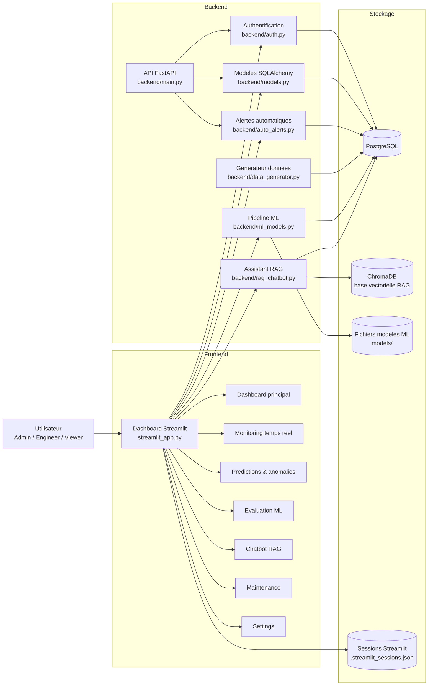
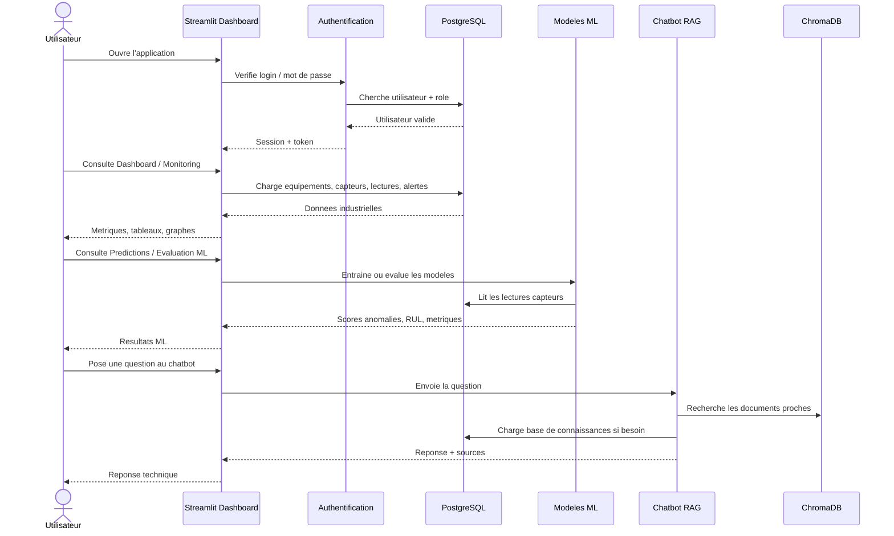
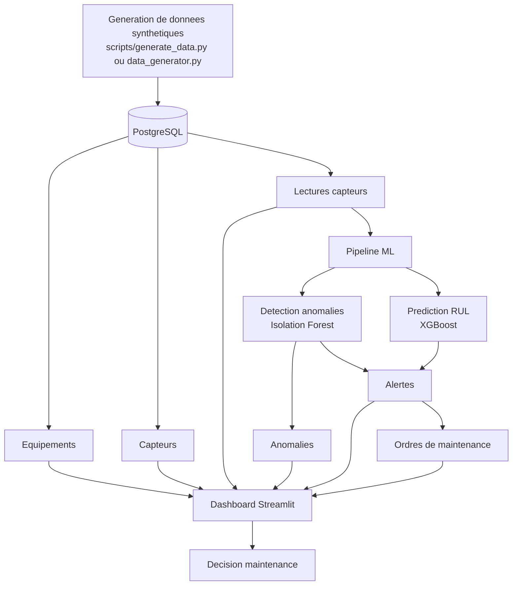
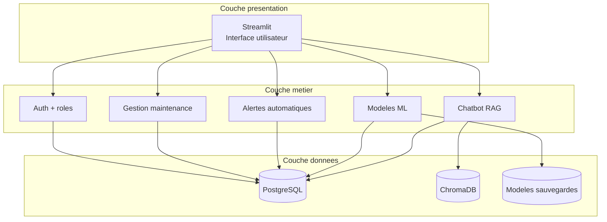

# Schema du projet - Maintenance Predictive ONEE

Ce document resume l'architecture du projet pour comprendre rapidement le role de chaque partie.

## 1. Vue globale

## 2. Parcours utilisateur

## 3. Flux des donnees

## 4. Role des pages du dashboard

| Page | Role principal |
| --- | --- |
| Dashboard | Vue generale: equipements, capteurs, alertes, anomalies |
| Monitoring | Suivi temps reel des mesures capteurs par equipement |
| Predictions | Affiche RUL, risques et anomalies detectees |
| Evaluation ML | Mesure la qualite des donnees et les performances ML |
| Chatbot | Assistant technique base sur RAG et base de connaissances |
| Maintenance | Acquitter les alertes et creer des ordres de maintenance |
| Settings | Profil utilisateur, stats systeme, test base de donnees |

## 5. Architecture technique simplifiee

## 6. Resume tres simple

Le projet fonctionne comme un systeme de supervision industrielle:

1. Des donnees de capteurs sont stockees dans PostgreSQL.
2. Le dashboard Streamlit affiche l'etat des equipements.
3. Les modeles ML detectent les anomalies et estiment le RUL.
4. Les alertes sont creees selon les seuils ou les anomalies.
5. Les utilisateurs peuvent traiter les alertes et creer des ordres de maintenance.
6. Le chatbot RAG aide l'utilisateur avec des explications techniques et des procedures.

